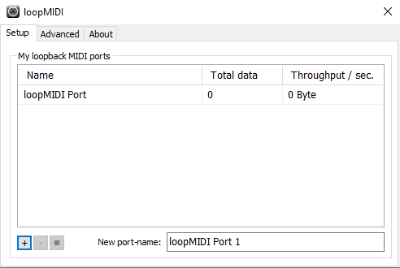

# Mac

## On Mac, you can use the IAC bus to create any number of virtual MIDI buses.
* This driver can be activated in the Audio MIDI Setup Utility:
  1. Launch Audio MIDI Setup and select Show MIDI Studio from the menu.
  
  2. Now double-click the IAC Driver icon and check the option Device is online in order to activate it.
  

# Windows

## Windows does not come with a native virtual MIDI driver, but there are a number of options available for free:

* [RTP loopMIDI](http://www.tobias-erichsen.de/software/loopmidi.html) developed by Tobias Erichsen:
  1. Install loopMIDI
  2. Open loopMIDI and click the plus on the bottom left to add a MIDI port:
  
  3. Use the name of the port in Supercollider like so:
    ```
    //MIDI
    MIDIClient.init;
    //Note: you need to put the correct name here, IAC (etc.) is for a Mac
    ~midiOut = MIDIOut.newByName("loopMIDI Port", "loopMIDI Port");
    ~dirt.soundLibrary.addMIDI(\midi, ~midiOut);
    ~midiOut.latency = 0.0;
    ```

* There is also MIDI Yoke as an option. As a part of the [MIDI OX Utility](http://www.midiox.com/), is probably the best-known Windows equivalent to Mac's IAC Bus. Note: It's 32-bit only.
